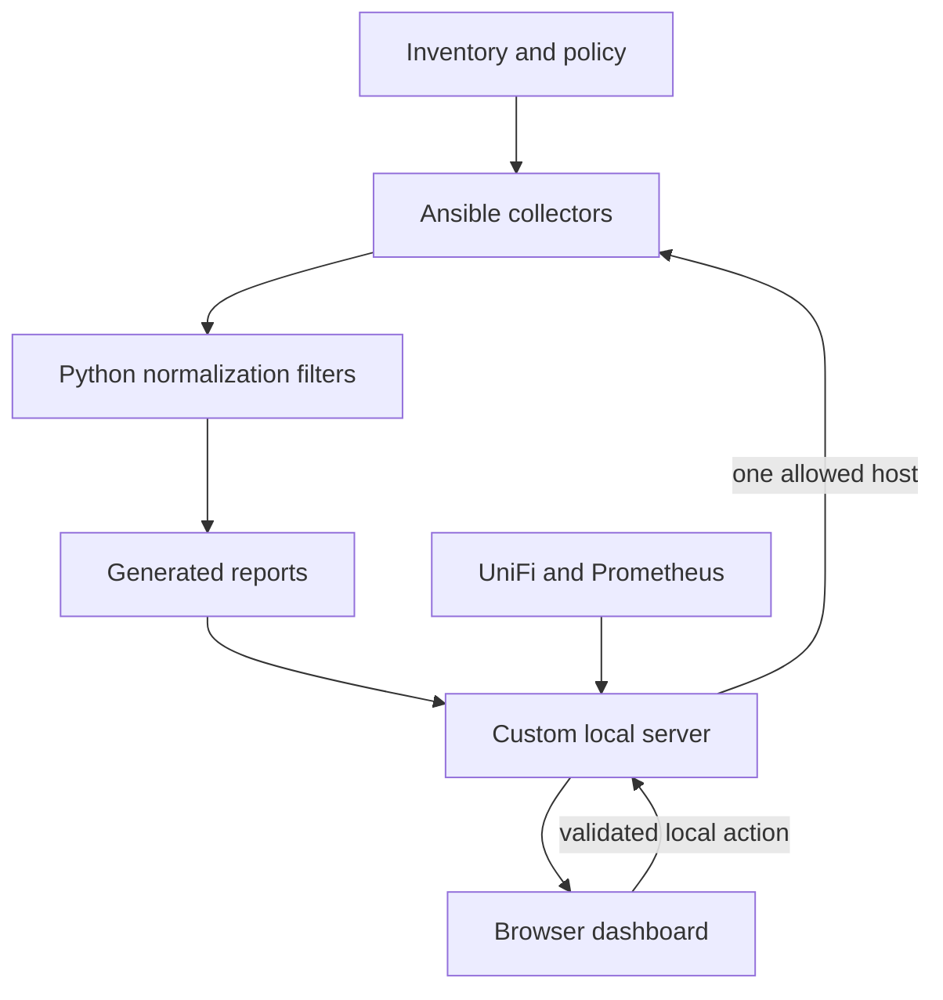

# Hackwell infrastructure monitoring

This repository collects infrastructure health with Ansible, converts the
results into a stable JSON contract, and serves a local interactive dashboard.
It also contains a separate controlled ERPNext update workflow.

Start with this mental model:



The critical distinction is between **source files** and **published files**:

- `dashboard/` contains the maintained interface and custom server source.
- `reports/` contains generated host data and published interface copies.
- `dashboard/server.py` serves `reports/` and provides the local APIs.
- `python3 -m http.server` is not a valid replacement.

## Normal operating flow

1. `inventory/hosts.yml` defines Ansible connection/group membership, while
   `inventory/infrastructure-registry.yml` declares stable infrastructure
   identity, topology, runtime workloads, edge dependencies, service relationships, and logging intent.
2. `playbooks/health-check.yml` checks Linux and TrueNAS hosts.
3. `roles/health_check/` discovers capabilities, applies policy, collects raw
   evidence, normalizes it, assigns status, and builds the dashboard schema.
4. Reports are written into `reports/` on the controller laptop.
5. The playbook validates the infrastructure registry against inventory, then
   publishes the maintained HTML/CSS/JavaScript, registry, manifest, and live
   storage topology into `reports/`.
6. `dashboard/server.py` serves that directory on `127.0.0.1:8088`, validates
   and exposes `/api/registry`, resolves service placement through workloads, adds UniFi data, and provides narrowly bounded
   maintenance endpoints.
7. The browser loads the registry, manifest, host reports, storage topology,
   event history, maintenance history, and optional UniFi summary.
8. `playbooks/logging-stack.yml` is a separate, explicit observability mutation: it deploys a private single-node Loki backend on `docker-ct`, Grafana Alloy collectors on registry-declared Linux hosts, and provisions the existing Grafana container with the EchoDATA Loki datasource. It is never run by the routine health-check playbook.

## Run or refresh the system

Generate fresh data and publish the interface:

```bash
cd "$HOME/infrastructure/ansible"
ansible-playbook playbooks/health-check.yml
```

Inspect the persistent dashboard service:

```bash
systemctl --user status hackwell-dashboard.service --no-pager
journalctl --user -u hackwell-dashboard.service -n 100 --no-pager
```

Open <http://127.0.0.1:8088/>.

The tracked service example is in
`systemd/hackwell-dashboard.service.example`. See
`docs/RUNTIME-OPERATIONS.md` before installing or changing it.

## Central logging

The logging topology is declared in `inventory/infrastructure-registry.yml`. Loki is kept on the private LAN and is not a Cloudflare/public service. Alloy forwards systemd journal logs from managed Linux hosts; `docker-ct` additionally forwards Docker container logs. The same explicit playbook adopts the existing `grafana` container, provisions `EchoDATA Loki` through its persistent datasource bind mount, and publishes an `EchoDATA Logs` dashboard into the existing dashboard provider; it does not install a second Grafana instance.

Deploy or reconcile logging explicitly:

```bash
cd "$HOME/infrastructure/ansible"
ansible-playbook playbooks/logging-stack.yml
```

This is intentionally separate from `health-check.yml` because installing packages, changing service groups, and starting containers are infrastructure mutations rather than monitoring reads.


## Status language

| State | Meaning |
| --- | --- |
| `OK` | Evidence is healthy and no action is required. |
| `WATCH` | Stable or uncertain evidence should remain visible, but it is not active deterioration. |
| `WARNING` | A real condition needs review or planned action. |
| `CRITICAL` | Strong evidence indicates an immediate health or data-protection risk. |
| `UNKNOWN` | Required evidence could not be collected or interpreted safely. |
| `UNREACHABLE` | Ansible could not reach the host; the remaining checks did not run. |

`WATCH` must not be silently promoted to `WARNING`, and failed collection must
not be presented as `OK`.

## Documentation is part of the implementation

Every maintained file begins with a `TEACHER NOTE` and
`CHANGE INSTRUCTIONS`. Long files are divided into chapters explaining why the
sections exist and how data crosses their boundaries.

Read:

- `docs/INFRASTRUCTURE-TEACHER-GUIDE.md` for the complete system walkthrough;
- `docs/FILE-MAP.md` to locate the producer and consumer of every maintained file;
- `docs/CHANGE-PROTOCOL.md` before editing;
- `docs/RUNTIME-OPERATIONS.md` for service and troubleshooting commands;
- `AGENTS.md` for the mandatory repository rules.
