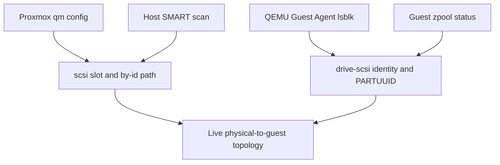

# Infrastructure teacher guide

This guide explains the infrastructure as a continuous flow. It is organized
in chapters that match the teacher notes inside the source files. The goal is
to make it possible to start at any displayed value and trace it backward to
the command, policy, and machine that produced it.

## Chapter 1 — The four layers

The monitoring system has four layers with deliberately separate jobs.

### Layer A: declaration

`inventory/hosts.yml` says which machines exist and which groups they belong
to. Host and group variables can declare capabilities or override optional
modules. Inventory is intent; it is not health evidence.

`roles/health_check/defaults/main.yml` supplies global thresholds and default
policy. A host-specific declaration wins over automatic capability discovery.

### Layer B: observation and interpretation

The health-check role runs fixed commands on managed machines. Raw command
output is registered as Ansible variables. Small YAML task files handle simple
results. Python filter plugins handle parsing and correlation that would be
unsafe or unreadable in Jinja alone.

This layer must distinguish:

- capability absent: module is not applicable;
- capability present but deliberately disabled: module is skipped by policy;
- collection failed: module status is `unknown`;
- evidence observed: module status is healthy, watch, warning, or critical.

### Layer C: publication

Each host becomes a JSON report and a human-readable Markdown report under
`reports/`. `dashboard_schema.yml` is the contract adapter between internal
Ansible facts and the browser-facing schema.

The final play in `playbooks/health-check.yml` also publishes the interface,
storage topology, and manifest. The browser never inventories the fleet on its
own; it trusts the manifest as the allowed and displayed host set.

### Layer D: presentation and controlled actions

`dashboard/server.py` serves the published directory. It also:

- reads the manifest as an action allowlist;
- runs one fixed Ansible action at a time;
- stores bounded maintenance history;
- queries fixed Prometheus expressions;
- optionally merges the authoritative UniFi adopted-device roster;
- rejects non-loopback action requests.

`dashboard/assets/dashboard.js` loads the published contracts and renders the
fleet tree, inspector, detail dialog, network view, and activity drawer.

## Chapter 2 — Repository map and ownership

| Path | Kind | Responsibility | Safe way to change it |
| --- | --- | --- | --- |
| `ansible.cfg` | Configuration | Inventory, roles, SSH and privilege defaults | Validate connectivity and syntax |
| `inventory/` | Configuration | Hosts, groups, feature intent and overrides | Run inventory graph plus limited health check |
| `playbooks/health-check.yml` | Orchestration source | Orders collection and publication | Run syntax check and full tests |
| `roles/health_check/tasks/` | Collection/policy source | Collects and assembles evidence | Test the affected module and schema |
| `roles/health_check/filter_plugins/` | Interpretation source | Parses and correlates complex evidence | Add fixtures and unit tests |
| `dashboard/` | Application source | Browser UI and custom local server | Publish, test, then restart service |
| `reports/` | Generated/runtime output | Reports, manifest, published assets and history | Do not hand-edit |
| `.state/health_check/` | Private runtime state | Trusted first-seen patch history | Do not publish or reset casually |
| `tests/` | Executable documentation | Locks down behaviour and safety | Update with every intentional contract change |
| `systemd/` | Deployment example | Correct persistent server command | Compare with installed user unit |

## Chapter 3 — Inventory, groups, and host topology

Inventory groups answer different questions:

- `managed_linux`: run the standard Linux health role;
- `truenas_hosts`: run the TrueNAS-specific collector;
- `monitoring_enabled`: publish the host in the manifest and permit dashboard
  actions;
- technology groups such as `proxmox_hosts` and `pbs_servers`: describe fleet
  intent and make host selection readable.

The UI parent-child tree is separate from Ansible group membership.
`dashboard/assets/dashboard-topology.json` describes presentation relationships
such as `scale` under `nimbus`. This separation prevents UI layout choices from
changing which playbooks run.

To add a host safely:

1. Add it to an appropriate inventory group.
2. Ensure it is inherited by `monitoring_enabled` if it should appear.
3. Add only explicit feature overrides that discovery cannot determine.
4. Add an optional topology entry if it is a guest of another node.
5. Run a limited health check.
6. Confirm the new report and manifest entry before checking the UI.

## Chapter 4 — Capability discovery versus policy

`feature_discovery.yml` asks whether commands such as Docker, Proxmox, PBS,
ZFS, or SMART are usable. The result is observation.

`feature_policy.yml` combines three sources:

1. safe defaults;
2. detected capabilities;
3. explicit inventory overrides.

It then derives monitoring modules and validates impossible combinations. This
is what keeps modules optional without turning the role into per-host code.

The important rule is: **discovery answers “can”; policy answers “should.”**

## Chapter 5 — The Linux collection pipeline

`roles/health_check/tasks/main.yml` is the table of contents for a Linux host:

1. discover and normalize features;
2. collect baseline resource and service evidence;
3. interpret APT and automation posture;
4. load the prior report for historical comparisons;
5. run optional technology modules;
6. calculate the first overall health state;
7. enrich the report with resource and policy checks;
8. adapt the data to the browser schema;
9. publish JSON and Markdown on the controller.

Tasks use `changed_when: false` for observations. A monitoring run should not
claim it modified a managed host.

## Chapter 6 — Status aggregation

Module filters return a standard object:

```json
{
  "check": "smart",
  "status": "watch",
  "summary": "7 device(s) under observation",
  "details": {}
}
```

Internal module states are lowercase; the published dashboard states are
uppercase. Aggregation chooses the worst credible state. `UNKNOWN` represents
missing evidence and must remain distinct from a warning based on real
evidence.

SMART is intentionally evidence-based:

- stable historical counters may be `WATCH`;
- increasing counters or confirmed media/link evidence may be `WARNING`;
- a failed SMART assessment or strong I/O failure evidence may be `CRITICAL`;
- unrecognized vendor attributes are not treated as certain failures.

## Chapter 7 — Patch intelligence and trusted history

The patch pipeline does not run `apt update` during a normal health check. It
classifies candidates from cached APT metadata and first decides whether that
metadata is fresh enough to trust.

`patch_intelligence.py` parses simulated APT lines and classifies security
packages by operational impact. `patch_state.yml` keeps private controller-side
history so a package’s pending age survives across runs. Untrusted collection
must not erase trusted history.

Patch posture is separate from host health. A machine can be physically
healthy while maintenance is due.

## Chapter 8 — Storage correlation

The storage pipeline joins evidence from several namespaces:



The stable join keys matter more than `/dev/sdX`, which can change after boot.
The filter keeps incomplete joins visible rather than inventing a pool
membership. `reports/storage-topology.json` is generated from this live join.

## Chapter 9 — Report contracts

`dashboard_schema.yml` converts internal facts to a stable browser contract:

- top-level identity and timestamps;
- `health_status` and reasons;
- independent patch posture and reasons;
- ordered `metrics` with display types;
- ordered `sections` with category and renderer hints;
- standardized `module_results`.

When changing a schema field, update all four consumers together:

1. Ansible producer;
2. Markdown template if human reports use it;
3. browser renderer;
4. tests and teacher notes.

Increase `schema_version` only for an intentional contract revision, not a
styling change.

## Chapter 10 — Publication and the web root

The publication play copies `dashboard/index.html` and `dashboard/assets/` to
`reports/`, then writes `manifest.json` and `storage-topology.json` there.

This explains the apparent duplication:

- edit `dashboard/`;
- publish into `reports/`;
- serve `reports/`.

Serving `dashboard/` alone cannot find the generated manifest and host data.
Serving the repository root shows a directory listing. Serving `reports/`
through the custom server is the complete arrangement.

## Chapter 11 — Why the custom server is mandatory

The custom server combines static publication with narrow local APIs:

| Route | Method | Purpose |
| --- | --- | --- |
| `/` and static paths | GET | Published dashboard and reports |
| `/api/health-check/status` | GET | Current background action state |
| `/api/unifi/summary` | GET | Bounded network summary |
| `/api/health-check/<host>` | POST | Run one allowed host health check |
| `/api/security-update/<host>` | POST | Run one explicitly confirmed security update |

Action safety comes from several layers: loopback binding, same-origin checks,
a custom request header, strict hostname syntax, manifest membership, one
concurrent job, fixed command arrays, no shell, bounded request bodies, and a
separate playbook safety gate.

## Chapter 12 — UniFi integration

UniFi uses two sources because they answer different questions:

- the controller API is authoritative for which devices are still adopted and
  whether they are currently online;
- Prometheus/Unpoller supplies metrics, counters, ratios, and history.

The browser cannot issue PromQL. The server owns a fixed allowlist of queries,
normalizes the results, derives WAN/Wi-Fi/switching/device health, and returns a
bounded summary.

Configuration lives in `dashboard-topology.json`; the API key does not. The key
must be supplied only through `DASHBOARD_UNIFI_API_KEY` in the server process
environment.

If `/api/unifi/summary` returns 404, the integration is disabled or the wrong
server is running. If it returns 503, the custom server is running but an
upstream query failed. These are different failures.

## Chapter 13 — Browser application

The browser starts by loading, in parallel:

- `manifest.json`;
- `assets/dashboard-topology.json`;
- `storage-topology.json`;
- `/api/unifi/summary`.

It then loads each host report and maintenance history. The state object is the
single in-browser model. Render functions convert that state to HTML; event
delegation converts clicks into selections, collapses, dialogs, or validated
API calls.

The Network node is conditional on a valid UniFi summary. Its absence should
be treated as integration degradation, not as proof the network is healthy.

## Chapter 14 — Controlled maintenance

The health-check button starts a fixed, read-only playbook limited to one host.
The security-update button requires explicit confirmation for the exact host.
The server then runs the security playbook and refreshes the health report.

The security playbook:

1. refreshes metadata;
2. recalculates the exact security set;
3. validates package names and count;
4. simulates the exact install;
5. refuses any removal plan;
6. installs only the approved upgrade set;
7. audits dpkg state;
8. never reboots automatically.

Maintenance history is written atomically and bounded so a broken write cannot
destroy the previous record or grow without limit.

## Chapter 15 — Persistent runtime

The user systemd service must start `dashboard/server.py` from the Ansible
repository and pass the reports directory. User lingering allows it to start
without an interactive login. See `docs/RUNTIME-OPERATIONS.md`.

A service being `active` proves only that a process exists. Functional checks
must also verify the manifest, action status, and UniFi endpoint.

## Chapter 16 — Extending the system

### Add a monitoring module

1. Add the feature default.
2. Add discovery if the capability can be detected safely.
3. Add policy derivation and validation.
4. Create a leaf task file that produces the standard module-result object.
5. Include it from `tasks/main.yml`.
6. Add schema rendering only if the generic module renderer is insufficient.
7. Add fixtures and tests for healthy, failed collection, warning and critical
   evidence.
8. Update the nearby teacher notes.

### Add a browser metric

1. Define it in `dashboard_schema.yml`.
2. Reuse an existing display type when possible.
3. Update the renderer only if a new display contract is necessary.
4. Add a layout/contract test.
5. Republish the dashboard and inspect both light and dark modes.

### Change a threshold

1. Change policy in defaults or inventory, not JavaScript.
2. Confirm the module and overall aggregation agree.
3. Update tests at the boundary values.
4. Explain the operational meaning in the same file.

## Chapter 17 — Troubleshooting by boundary

| Symptom | First boundary to inspect |
| --- | --- |
| Browser cannot open | systemd status and port 8088 |
| Directory listing | wrong working directory or generic server |
| `manifest.json` 404 | wrong web root or dashboard not published |
| One host missing | inventory group, manifest, then host report |
| Host shows unknown | module collection return codes and reasons |
| Network node missing | custom server, topology config, then UniFi endpoint |
| UniFi endpoint 503 | Prometheus/controller reachability and server journal |
| Storage pool lacks physical members | QGA, by-id mapping, lsblk, PARTUUID, zpool join |
| Button says controller unavailable | custom server route or browser origin |
| UI change does not appear | publish task and browser cache |

Always locate the broken boundary before editing code.

## Chapter 18 — Definition of done

A change is complete only when:

- behaviour works at the intended layer;
- generated outputs still match their contracts;
- no optional integration silently disappears;
- tests cover the changed assumption;
- teacher notes explain the new behaviour and safe modification path;
- the relevant validation commands pass;
- runtime installation instructions remain accurate.

## Chapter 19 — Separate ERPNext controlled-update workflow

The ERPNext role shares the Ansible repository and controller conventions, but
it is not part of dashboard health collection. Keeping that boundary explicit
prevents a read-only monitoring change from accidentally becoming an
application deployment change.

The workflow is split into three entry points:

- `erpnext-update-check.yml`: compare the deployed Compose image tag with the
  latest stable v16 release;
- `erpnext-backup-test.yml`: exercise the verified backup path alone;
- `erpnext-update.yml`: enter the mutating workflow after internal gates pass.

The role stages are:

1. validate mode;
2. read and validate exactly one current Compose version;
3. select stable official upstream releases;
4. enforce a release-age delay;
5. verify free space and production prerequisites;
6. create and verify database, site configuration, public files, private files,
   Compose, and common-site configuration recovery artifacts;
7. enforce bounded backup retention;
8. update the Compose tag and containers;
9. run migration and health checks;
10. verify both local and public endpoints.

This workflow is production mutation. Changes require a recovery checkpoint and
must not be validated merely by the monitoring unit suite.
